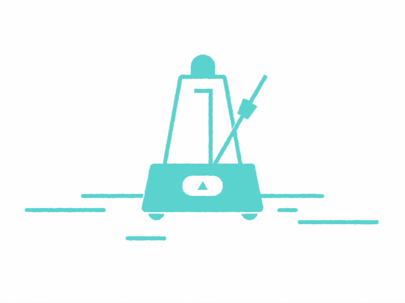
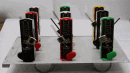

<div id="top"></div>
<!--
*** Thanks for checking out the Best-README-Template. If you have a suggestion
*** that would make this better, please fork the repo and create a pull request
*** or simply open an issue with the tag "enhancement".
*** Don't forget to give the project a star!
*** Thanks again! Now go create something AMAZING! :D
-->


<!-- PROJECT SHIELDS -->
<!--
*** I'm using markdown "reference style" links for readability.
*** Reference links are enclosed in brackets [ ] instead of parentheses ( ).
*** See the bottom of this document for the declaration of the reference variables
*** for contributors-url, forks-url, etc. This is an optional, concise syntax you may use.
*** https://www.markdownguide.org/basic-syntax/#reference-style-links
-->


<!-- PROJECT LOGO -->
<br />
<div align="center">
  <a href="https://github.com/github_username/repo_name">
    
  </a>

<h3 align="center">Simulation of nonlinear oscillators</h3>

  <p align="center">
    This project is a part of the ASCII mentorship program for the year 2022-23
    <br />
    <a href="https://github.com/github_username/repo_name"><strong>Explore the docs »</strong></a> 
  </p>
</div>


<!-- TABLE OF CONTENTS -->
<details>
  <summary>Table of Contents</summary>
  <ol>
    <li>
      <a href="#about-the-project">About The Project</a>
      <ul>
        <li><a href="#built-with">Built With</a></li>
      </ul>
    </li>
    <li>
      <a href="#getting-started">Getting Started</a>
      <ul>
        <li><a href="#prerequisites">Prerequisites</a></li>
        <li><a href="#installation">Installation</a></li>
      </ul>
    </li>
    <li><a href="#usage">Usage</a></li>
    <li><a href="#roadmap">Roadmap</a></li>
    <li><a href="#contributing">Contributing</a></li>
    <li><a href="#license">License</a></li>
    <li><a href="#contact">Contact</a></li>
    <li><a href="#acknowledgments">Acknowledgments</a></li>
  </ol>
</details>


<!-- ABOUT THE PROJECT -->
## About The Project


Here's a blank template to get started: To avoid retyping too much info. Do a search and replace with your text editor for the following: `github_username`, `repo_name`, `twitter_handle`, `linkedin_username`, `email_client`, `email`, `project_title`, `project_description`

<p align="right">(<a href="#top">back to top</a>)</p>


<!-- GETTING STARTED -->
## Introduction
<q> In 1665, Christiaan Huygens observed that two pendulum clocks suspended on a beam always ended up swinging in exact anti-phase motion (1) regardless of each pendulum’s initial displacement. He explained this self-emergent synchronization as resulting from the coupling between the clocks, which was mediated by vibrations traveling across the beam. Huygens’ serendipitous discovery has inspired many studies to establish that self-emergent synchronization is a central process to a spectacular variety of natural systems, including the beating of the heart (2), flashing fireflies (3), pedestrians on a bridge locking their gait (4), circadian clocks in the brain (5), superconducting Josephson junctions (6), chemical oscillations (7, 8), metabolic oscillations in yeast cells (9), and life cycles of phytoplankton (10). </q>
[You will find the cited resources at the end of this file]

Nonlinear Oscillators are strikingly crucial in modelling most of the complex dynamic problems. To a large extent, first order approximations provides a decent linear model for these problems. But to really study the depths of synchronization and the various emergent states associated to it, nonlinear oscillators are inevitable to be tackled with. There is no analytical approach that fully solves these differential equations - although, many analytical approximations are extremely useful to get a qualitative feel to them. So, the numerical simulations of such systems are often the only way to study the evolution of nonlinear differential equations.  

### Phases of the project
#### Phase I:
The simulation of a system of metronomes coupled by a swing. Specifically, this will be the simulation of the Van der Pol oscillator - one of the most important nonlinear oscillators. This will be a work to reproduce the simulations that I have previously worked with. You will be using in-built MATLAB libraries and ode solvers to simply get a feel of how numerical simulations in MATLAB works. The final simulation is already attached in this repo, although I would implore you to try to write the code on your own before you look at the solution.



### Phase II:
There are two equally important branch of contributions to be made to this project, depending on your domain of interest. You can either work further on the computational physics surrounding different models similar to the Van derPol model. Or you can work on analysing the Kuramoto system using analytical methods.
<ul>
  <li> If you are interested in the simulation aspect of this project, we will spend some time learning the basics of computational physics - the various numerical methods that these MATLAB functions use to integrate complex differential equations. After you have some idea of tracking and tackling divergent solutions, the main line of work is to simulate a significantly harder equation that more accurately models the metronome systems than the cookie cutter Van der Pol model. The biggest hurdle to simulate such an equation is the presence of non-differentiable functions that have kinks in the graph. You'll learn how such functions can lead to garbage simulation results if you're not careful enough.
   <li> If you are looking to dive deeper into the physics of nonlinear oscillators, we will simulate the Kuramoto model which is a significantly easier set of differential equations to model as compared to the toy Van der Pol problem you have already worked on. Currently, I am working to find the various phase-locked states of Kuramoto models and study the critical connectivity required in a ring of oscillators to achieve global synchrony. There are many open problems in the field, and we will be working on developing analytical approaches to predict the evolution of the Kuramoto oscillators. For this, you might need to also spend some time learning the basics of Nonlinear Dynamics.
 </ul> 

### Prerequisites

This is an example of how to list things you need to use the software and how to install them.
* npm
  ```sh
  npm install npm@latest -g
  ```

### Installation

1. Get a free API Key at [https://example.com](https://example.com)
2. Clone the repo
   ```sh
   git clone https://github.com/github_username/repo_name.git
   ```
3. Install NPM packages
   ```sh
   npm install
   ```
4. Enter your API in `config.js`
   ```js
   const API_KEY = 'ENTER YOUR API';
   ```

<p align="right">(<a href="#top">back to top</a>)</p>


<!-- USAGE EXAMPLES -->
## Usage

Use this space to show useful examples of how a project can be used. Additional screenshots, code examples and demos work well in this space. You may also link to more resources.

_For more examples, please refer to the [Documentation](https://example.com)_

<p align="right">(<a href="#top">back to top</a>)</p>


<!-- ROADMAP -->
## Roadmap

- [ ] Feature 1
- [ ] Feature 2
- [ ] Feature 3
    - [ ] Nested Feature

See the [open issues](https://github.com/github_username/repo_name/issues) for a full list of proposed features (and known issues).

<p align="right">(<a href="#top">back to top</a>)</p>


<!-- CONTRIBUTING -->
## Contributing

Contributions are what make the open source community such an amazing place to learn, inspire, and create. Any contributions you make are **greatly appreciated**.

If you have a suggestion that would make this better, please fork the repo and create a pull request. You can also simply open an issue with the tag "enhancement".
Don't forget to give the project a star! Thanks again!

1. Fork the Project
2. Create your Feature Branch (`git checkout -b feature/AmazingFeature`)
3. Commit your Changes (`git commit -m 'Add some AmazingFeature'`)
4. Push to the Branch (`git push origin feature/AmazingFeature`)
5. Open a Pull Request

<p align="right">(<a href="#top">back to top</a>)</p>


<!-- LICENSE -->
## License

Distributed under the MIT License. See `LICENSE.txt` for more information.

<p align="right">(<a href="#top">back to top</a>)</p>


<!-- CONTACT -->
## Contact

Your Name - [@twitter_handle](https://twitter.com/twitter_handle) - email@email_client.com

Project Link: [https://github.com/github_username/repo_name](https://github.com/github_username/repo_name)

<p align="right">(<a href="#top">back to top</a>)</p>


<!-- ACKNOWLEDGMENTS -->
## Acknowledgments

* []()
* []()
* []()

<p align="right">(<a href="#top">back to top</a>)</p>


<!-- MARKDOWN LINKS & IMAGES -->
<!-- https://www.markdownguide.org/basic-syntax/#reference-style-links -->
[contributors-shield]: https://img.shields.io/github/contributors/github_username/repo_name.svg?style=for-the-badge
[contributors-url]: https://github.com/github_username/repo_name/graphs/contributors
[forks-shield]: https://img.shields.io/github/forks/github_username/repo_name.svg?style=for-the-badge
[forks-url]: https://github.com/github_username/repo_name/network/members
[stars-shield]: https://img.shields.io/github/stars/github_username/repo_name.svg?style=for-the-badge
[stars-url]: https://github.com/github_username/repo_name/stargazers
[issues-shield]: https://img.shields.io/github/issues/github_username/repo_name.svg?style=for-the-badge
[issues-url]: https://github.com/github_username/repo_name/issues
[license-shield]: https://img.shields.io/github/license/github_username/repo_name.svg?style=for-the-badge
[license-url]: https://github.com/github_username/repo_name/blob/master/LICENSE.txt
[linkedin-shield]: https://img.shields.io/badge/-LinkedIn-black.svg?style=for-the-badge&logo=linkedin&colorB=555
[linkedin-url]: https://linkedin.com/in/linkedin_username
[product-screenshot]: images/screenshot.png
[Next.js]: https://img.shields.io/badge/next.js-000000?style=for-the-badge&logo=nextdotjs&logoColor=white
[Next-url]: https://nextjs.org/
[React.js]: https://img.shields.io/badge/React-20232A?style=for-the-badge&logo=react&logoColor=61DAFB
[React-url]: https://reactjs.org/
[Vue.js]: https://img.shields.io/badge/Vue.js-35495E?style=for-the-badge&logo=vuedotjs&logoColor=4FC08D
[Vue-url]: https://vuejs.org/
[Angular.io]: https://img.shields.io/badge/Angular-DD0031?style=for-the-badge&logo=angular&logoColor=white
[Angular-url]: https://angular.io/
[Svelte.dev]: https://img.shields.io/badge/Svelte-4A4A55?style=for-the-badge&logo=svelte&logoColor=FF3E00
[Svelte-url]: https://svelte.dev/
[Laravel.com]: https://img.shields.io/badge/Laravel-FF2D20?style=for-the-badge&logo=laravel&logoColor=white
[Laravel-url]: https://laravel.com
[Bootstrap.com]: https://img.shields.io/badge/Bootstrap-563D7C?style=for-the-badge&logo=bootstrap&logoColor=white
[Bootstrap-url]: https://getbootstrap.com
[JQuery.com]: https://img.shields.io/badge/jQuery-0769AD?style=for-the-badge&logo=jquery&logoColor=white
[JQuery-url]: https://jquery.com 
